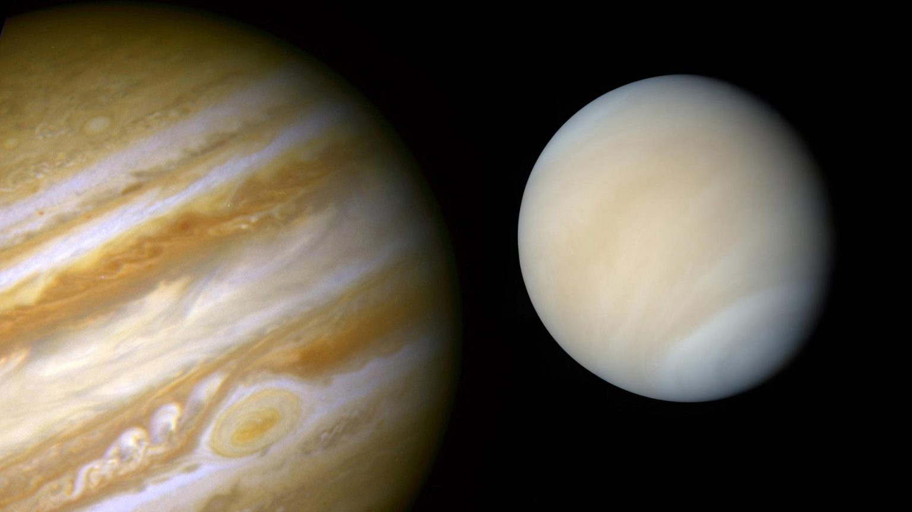

Venuvia
===================================

.. raw:: html

   
<em>Image credit: NASA</em>

**Venuvia** is an experimental backend for large-scale hypergraph computation implemented as a CPU-only framework and architected around the Partitioned Global Address Space (PGAS) paradigm.

This backend is primarily aimed at solving hypergraph algorithms using probabilistic inferences and Bayesian decision making while also allowing the native expression of probabilistic programming models as hypergraphs ie structural causal models (SCM) and gaussian mixture models (GSM). 

.. note::

   This project is under active development.

Contents
--------

.. toctree::

   introduction
   workflow1
   workflow2
   workflow3
   usecases
   hypergraphalgorithms
   ppmodels
   usage
   api
   roadmap
